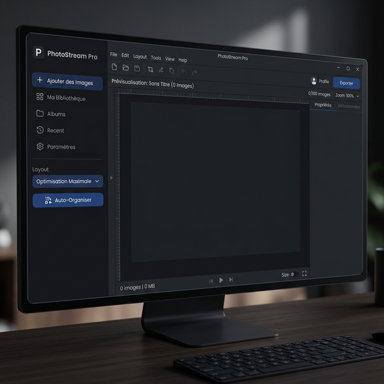
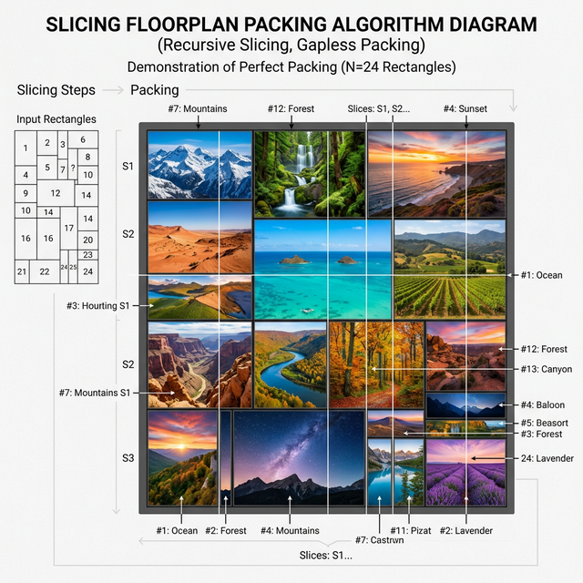

# 🎨 WallCraft Pro - Multi-Monitor-Hintergrundbild-Generator

🌍 **[English](README_en.md)** | **[Français](README.md)** | **[Español](README_es.md)** | **[Deutsch](README_de.md)**

**WallCraft Pro** ist eine leistungsstarke Python-Anwendung, mit der Sie Hintergrundbilder in komplexen Multi-Monitor-Setups erstellen, organisieren und anwenden können.

Sie löst das Problem unterschiedlicher Monitorauflösungen und Bildschirmränder durch ihre intelligente Engine vollständig: Sie ermöglicht das Zusammenfügen mehrerer Fotos, **ohne diese jemals zu verzerren oder zuzuschneiden**, und garantiert so eine **absolute 100%ige Sichtbarkeit** Ihrer Bilder ("Fit Inside"-Prinzip).



---

## 🚀 Hauptfunktionen

### 🖥️ Erweitertes Multi-Monitor-Management
- **Automatische Erkennung** der physischen Anordnung Ihrer Bildschirme (links/rechts, Höhe).
- **Native Implementierung**: Setzt pro Monitor ein anderes Hintergrundbild (über die Windows `IDesktopWallpaper`-API).
- **Fallback-Modus**: Wechselt automatisch in den "Panorama"-Modus (Span), falls die native API nicht unterstützt wird.

### 📐 Die Absolute "Fit Inside" Engine
Das Programm hält sich strikt an die 100 % Regel:
- **0 Zuschnitt (Crop)**: Die Ränder hochgeladener Bilder werden nicht abgeschnitten.
- **0 Überlappung**: Kein Foto verdeckt ein anderes Foto.
- **0 Überstand**: Bilder ragen niemals über die Bildschirmränder hinaus.
- **0 Verzerrung**: Das ursprüngliche Seitenverhältnis bleibt mathematisch gewahrt.

### 🧩 6 Layout-Algorithmen (Auto-Layout)
- ⭐ **Maximale Optimierung (Langsam)**: Das Herzstück der Anwendung. Es simuliert Hunderttausende geometrischer Permutationen über einen binären "Slicing Floorplan"-Baum, um Ihre Bilder lückenlos ineinander zu verschachteln und so einen riesigen Block zu formen, der schwarze Balken statistisch auf ein Minimum reduziert.
- **Perfektes Mosaik**: Eine randomisierte Patchwork-Anordnung (BSP-Technik).
- **Ausgerichtete Linien**: Ausrichtung ähnlich wie bei Flickr/Google Bilder.
- **Regelmäßiges Raster**: Ein mathematisch gleichmäßiges Raster.
- **Vertikale & Horizontale Streifen**: Panorama-Slicing über die volle Höhe oder volle Breite.



### ⚡ Leistung & Bearbeitung
- **Proxy-System**: Verwendet Miniaturansichten für eine extrem flüssige Benutzeroberfläche, selbst bei 8K-Bildern.
- **Integrierte Bildbearbeitung**: Helligkeit, Kontrast, Sättigung, Unschärfe und Drehung.
- **HD-Rendering**: Der endgültige Export verwendet die originalen Ultra-HD-Dateien für absolut maximale Qualität.

---

## 📦 Installation

### Voraussetzungen
- Python 3.8 oder höher.
- Windows 10/11 (Erforderlich aufgrund der Windows-Wallpaper-API).

### Abhängigkeiten
```bash
pip install pillow screeninfo
```

## 🛠️ Verwendung
1. Starten Sie die App: `python main.py`
2. **Bilder hinzufügen**: Klicken Sie auf die Schaltfläche oder ziehen Sie Dateien per Drag-and-Drop.
3. **Sprachmenü**: Wählen Sie EN/FR/ES/DE dynamisch direkt in der Benutzeroberfläche.
4. **Layout wählen**: Wählen Sie einen der 6 Modi ("Maximale Optimierung" wird dringend empfohlen, um schwarze Balken zu minimieren).
5. **Auto-Anordnen**: Klicken Sie auf den "🎲"-Button und überlassen Sie der Mathematik den Rest.
6. **Anwenden**:
    * 💾 Exportieren: Erstellt einen großen Entwurf.
    * ✂ Teilen (Split): Unterteilt die Komposition in Bilder, die exakt Ihren Monitoren entsprechen.
    * 🖥️ Anwenden: Ändert aktiv Ihren Windows-Desktop-Hintergrund in bester Qualität!

## 📂 Projektstruktur
* `main.py`: Einstiegspunkt, koppelt Windows High-DPI-Einstellungen.
* `ui.py`: Fenster, interaktive Arbeitsfläche, Menüs.
* `locales.py`: Mehrsprachiges Register.
* `image_tools.py`: Kerngeschäftslogik. Tiefe Bildmanipulation und Layout-Engine (`AutoLayoutStrategy`).
* `screen_splitter.py`: `ctypes` Systemaufrufe für die native Windows-Verknüpfung.

## 🐛 Fehlerbehebung
* **Ist die Anwendung unscharf?** Führen Sie sie über das Standard-Terminal von Windows (cmd/powershell) und nicht über eine Entwicklungsumgebung (IDE) aus. 
* **Sind schwarze Balken sichtbar?** Dies ist das erwartete Verhalten. Da die Anwendung Bilder absichtlich nicht zuschneidet ("No Crop"), wird der verbleibende Platz durch schwarze Balken gefüllt ("Fit Inside"). Verwenden Sie "Maximale Optimierung", um dies zu verringern.
